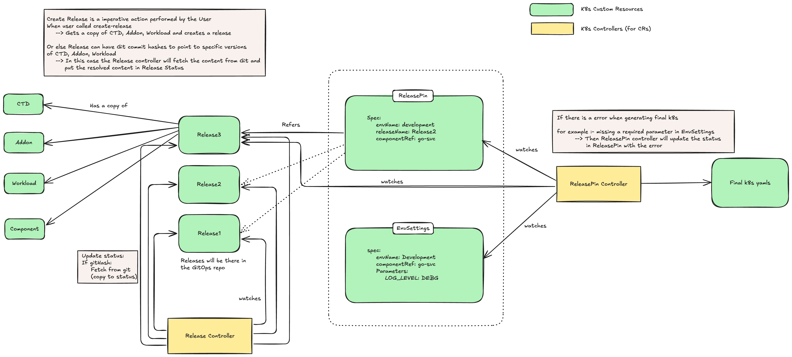
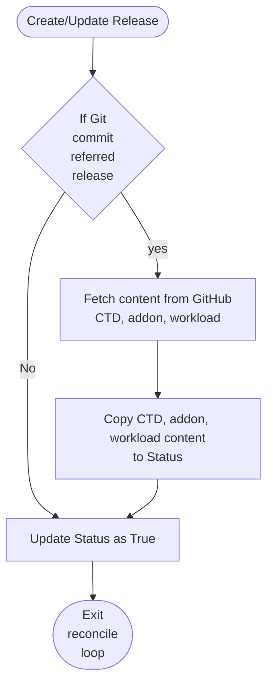

# Standardize Deployment and Promotion

**Authors**:
@yashodgayashan
@vajiraprabuddhaka

**Reviewers**:
@binura-g
@sameerajayasoma
@manjulaRathnayaka
@Mirage20
@lakwarus

**Created Date**:
2025-10-27

**Status**:
Pending

**Related Issues/PRs**:
[Discussion #554 – openchoreo/openchoreo](https://github.com/openchoreo/openchoreo/discussions/554)


## Summary

This proposal introduces a standardized deployment and promotion mechanism for OpenChoreo that works seamlessly with both UI/CLI and GitOps workflows. The design uses **Release** and **ReleasePin** CRs to provide an immutable, auditable way to promote component definitions across environments while maintaining environment-specific configuration separation.

The Release CR supports **two flexible approaches** for storing ComponentTypeDefinitions, Addons, and Components:
- **Git references** (lightweight Release, slower reconciliation): Release (Comparatively smaller to embedded content). Recommended for GitOps workflows.

- **Embedded content** (larger Release, faster reconciliation): Release (Comparatively larger to git references). For the UI and CLI paths, this has been used for deployments and promotions.

Users can choose the approach that best fits their workflow, or even mix both within the same Release, providing maximum flexibility while addressing etcd storage and performance concerns through garbage collection, git references, and planned compression support.

## Motivation

With the introduction of ComponentTypeDefinitions, Addons, and Workloads ([Proposal #537](0537-introduce-component-type-definitions.md)), OpenChoreo needs a robust deployment and promotion workflow that:

1. **Supports both UI/CLI and GitOps**: Users should be able to deploy and promote components through either the OpenChoreo UI/CLI or through GitOps workflows (ArgoCD, Flux, etc.) using the same underlying mechanism.

2. **Maintains environment isolation**: Promotable content (ComponentTypeDefinitions, Addons, Components, Workloads) should be separated from environment-specific configuration (EnvSettings).

3. **Provides auditability**: Every promotion should be traceable with clear history of what was deployed when and where.

4. **Enables GitOps-friendly workflows**: Promotions should result in clean Git diffs without circular dependencies or controller-generated commits that conflict with user changes.

### Problems with Initial Approach (Auto-Generated ComponentEnvSnapshot)

An initial approach where ComponentEnvSnapshot was **auto-generated on source changes** (ComponentTypeDefinition, Component, Addon, or Workload updates) revealed three critical issues:

1. **GitOps Circular Dependencies**: Auto-generating snapshots on source changes creates circular update loops. When addons or ComponentTypeDefinitions update, controllers auto-generate new snapshots and commit them to git, which triggers reconciliation, which may rollback snapshots before dependent resources sync, causing repeated commits and sync conflicts (as shown in the image below). **Resolution**: In this proposal, ComponentEnvSnapshot is generated on-demand by the ReleasePin controller during reconciliation, not automatically on source changes.


In the image above, when the Addon and ComponentEnvSnapshot are updated in the source code, if the AddOn reconciliation is triggered before the ComponentEnvSnapshot reconciliation, the ComponentEnvSnapshot will be rolled back to the previous version, causing a circular dependency.

2. **etcd Storage Bloat**: Large snapshot objects embedding full copies of CTD, Addon, Workload, and EnvSettings accumulate during frequent promotions across multiple environments, causing storage pressure. **Note**: This issue can still occur when using embedded content in the Release CR, but is mitigated through:
   - **Garbage collection** of unused/old Releases (configurable retention policies)
   - **Git references as an alternative** for users who prefer lightweight objects (GitOps workflows)

3. **Poor Developer Experience**: Exposing ComponentEnvSnapshot as the primary user-facing resource for promotions reveals internal implementation details rather than expressing the business intent of "deploy this release to this environment." **Resolution**: Release and ReleasePin become the user-facing abstractions with intuitive commands:
   - **UI**: "Deploy" button or "Promote" button with environment selection
   - **CLI**: `choreo deploy --environment <environment>` or `choreo promote --from <environment> --to <environment>`
   - ComponentEnvSnapshot remains an internal implementation detail


## Goals

- Provide a unified deployment and promotion model that works identically for UI/CLI and GitOps workflows
- Maintain separation between promotable content and environment-specific configuration
- Support immutable, auditable promotion history
- Produce clean, human-readable Git diffs for GitOps workflows
- Allow garbage collection of old releases to prevent unbounded growth
- Provide flexibility to choose between git references and embedded content based on workflow needs


## Non-Goals

- Automated promotion based on health checks or test results (can be built on top of this mechanism later)
- Blue-green or canary deployment strategies (these are orthogonal concerns)
- Rollback mechanisms (covered separately; this provides the foundation)


## Design

### Overview

The design introduces two primary user-facing CRDs and uses an existing user-facing resource:

1. **Release** (new, user-facing): An immutable, lightweight promotable unit that pins versions of ComponentTypeDefinitions, Addons, Components, and Workloads (similar to a lockfile)
2. **ReleasePin** (new, user-facing): A per-environment resource that references which Release is deployed to that environment
3. **EnvSettings** (existing, user-facing): An optional resource that defines environment-specific configuration (e.g., replica counts, resource limits)

This separation allows the same Release to be deployed to multiple environments with different EnvSettings, producing environment-specific manifests at reconciliation time.



High Level Architecture of the deployment and promotion workflow.

- UI/CLI: When developer triggers the deployment, the OpenChoreo API server will create the Release and ReleasePin for the first environment using Component, ComponentTypeDefinition, Addons with embedded content. When developer triggers the promotion, the OpenChoreo API server will update the target environment's ReleasePin to previous environment's Release. The ReleasePin controller will reconcile the ReleasePin and it generates final K8s yamls.
- GitOps: When developer do any update to the ReleasePin or Release/EnvSettings(that the ReleasePin refers) the ReleasePin controller will reconcile the ReleasePin and create final K8s yamls.

### 1. Release CR

A **Release** is an immutable snapshot of promotable content. It supports **two approaches** for storing ComponentTypeDefinition, Addon, Workload and Component: **git references** (from gitops repo) or **embedded content** (self-contained). The Workload is always embedded as it contains build output.

**Key characteristics:**
- Immutable once created
- Supports both git references and embedded content
- Workload is always embedded inline
- Each component reference must have **exactly one** of `gitRef` or `content`

#### Approach 1: Git References

Stores references to content using git commit SHAs. Keeps Release objects small (~2-5 KB).

```yaml
apiVersion: openchoreo.dev/v1alpha1
kind: Release
metadata:
  name: checkout-service-20251102-1
  labels:
    openchoreo.dev/component: checkout-service
spec:
  component:
    name: checkout-service
    gitRef:
      repository: https://github.com/myorg/openchoreo-infra
      revision: a1b2c3d4  # Git commit SHA
      path: components/checkout-service.yaml

  componentTypeDefinition:
    name: web-app
    gitRef:
      repository: https://github.com/myorg/openchoreo-infra
      revision: e5f6g7h8  # Git commit SHA
      path: component-types/web-app.yaml

  addons:
    - name: persistent-volume-claim
      gitRef:
        repository: https://github.com/myorg/openchoreo-infra
        revision: i9j0k1l2  # Git commit SHA
        path: addons/persistent-volume-claim.yaml

    - name: add-file-logging-sidecar
      gitRef:
        repository: https://github.com/myorg/openchoreo-infra
        revision: i9j0k1l2  # Git commit SHA
        path: addons/file-logging-sidecar.yaml

  workload:
    # Workload is always embedded (contains build output)
    apiVersion: openchoreo.dev/v1alpha1
    kind: Workload
    metadata:
      name: checkout-service
    spec:
      image: gcr.io/project/checkout-service:v1.2.3  # Built image
      endpoints:
        - name: api
          type: http
          port: 8080
          schemaPath: ./openapi/api.yaml
      connections:
        - name: productcatalog
          type: api
          params:
            projectName: gcp-microservice-demo
            componentName: productcatalog
            endpoint: grpc-endpoint
          inject:
            env:
              - name: PRODUCT_CATALOG_SERVICE_ADDR
                value: "{{ .host }}:{{ .port }}"
```

#### Approach 2: Embedded Content

Embeds full definitions directly in the Release. Self-contained but larger (~50-200 KB). For CLI and UI Releases will be generated by the Open Choreo API server on deployment or promotion.

```yaml
apiVersion: openchoreo.dev/v1alpha1
kind: Release
metadata:
  name: checkout-service-20251102-1
  labels:
    openchoreo.dev/component: checkout-service
    openchoreo.dev/version: v1.2.3
spec:
  component:
    name: checkout-service
    content:
      # Full embedded Component definition
      apiVersion: openchoreo.dev/v1alpha1
      kind: Component
      metadata:
        name: checkout-service
      spec:
        componentType: deployment/web-app
        parameters:
          lifecycle:
            terminationGracePeriodSeconds: 60
          resources:
            requests:
              cpu: 200m
              memory: 512Mi
        addons:
          - name: persistent-volume-claim
            instanceId: app-data
            config:
              volumeName: app-data-vol
              mountPath: /app/data

  componentTypeDefinition:
    name: web-app
    content:
      # Full embedded ComponentTypeDefinition
      apiVersion: openchoreo.dev/v1alpha1
      kind: ComponentTypeDefinition
      metadata:
        name: web-app
      spec:
        workloadType: deployment
        schema:
          parameters: { ... }
        resources: [ ... ]

  addons:
    - name: persistent-volume-claim
      instanceId: app-data
      content:
        # Full embedded Addon definition
        apiVersion: openchoreo.dev/v1alpha1
        kind: Addon
        metadata:
          name: persistent-volume-claim
        spec:
          creates: [ ... ]
          patches: [ ... ]

  workload:
    # Workload is always embedded
    apiVersion: openchoreo.dev/v1alpha1
    kind: Workload
    metadata:
      name: checkout-service
    spec:
      image: gcr.io/project/checkout-service:v1.2.3
      endpoints: [ ... ]
      connections: [ ... ]
```

#### When to Use Each Approach

**Use Git References when:**
- Working with GitOps workflows (ArgoCD, Flux, etc.)
- You want clean, readable git diffs for promotion reviews (Release is only ~2-5 KB)
- You want traceability to exact git commits
- ComponentTypeDefinitions/Addons are reused across multiple components
- Reconciliation speed is less critical (async git-triggered deployments)

**Use Embedded Content when:**
- Working with UI/CLI workflows (no git integration)
- You need **faster reconciliation**
- You want self-contained Releases (no external git dependencies)
- Definitions are dynamically generated by OpenChoreo API server


#### 1.1 Release Controller

The following flow chart describes how the Release controller works.



**Release Controller Reconciliation Summary:**

- **Git-referenced Releases**: When a Release uses git references (gitRef), the controller fetches the actual content (ComponentTypeDefinition, Addons, Workload) from the specified GitHub repository and copies it to the Release's status field for caching and observability
- **Embedded content Releases**: When a Release has embedded content, the controller directly marks the status as ready without any git operations
- **Status management**: After processing (either fetching from git or skipping for embedded content), the controller updates the Release status to True, indicating the Release is ready to be used by ReleasePin controllers
- **Reconciliation efficiency**: This design allows git-referenced Releases to cache resolved content in status, reducing repeated git fetches during subsequent reconciliations


### 2. ReleasePin CR

A **ReleasePin** represents which Release is currently deployed to a specific environment. It's a per-environment resource that creates the binding between a Release and an Environment.

**Key characteristics:**
- One ReleasePin per component per environment
- Mutable (updated during promotions)
- References a Release by name
- Lightweight (just a reference + environment identifier)

**Structure:**

```yaml
apiVersion: openchoreo.dev/v1alpha1
kind: ReleasePin
metadata:
  name: checkout-service-production
  labels:
    openchoreo.dev/component: checkout-service
    openchoreo.dev/environment: production
spec:
  component: checkout-service
  environment: production
  releaseName: checkout-service-20251102-1  # Points to a Release

status:
  # Status fields managed by controller
  appliedRelease: checkout-service-20251102-1
  observedGeneration: 1
  conditions:
    - type: Ready
      status: "True"
      lastTransitionTime: "2025-10-27T10:00:00Z"
      reason: ReconcileSuccess
      message: "Release successfully applied"
```

#### 2.1 ReleasePin Controller

- ReleasePin controller is responsible for generating the rendered Kubernetes manifests and applying them to the DataPlane.
- ReleasePin controller watches on the following resources:
    - ReleasePin
    - EnvSettings
    - Release (Corresponding to the ReleasePin's releaseName)

### 3. Deployment Flow

**Initial Deployment (First Environment)**

When a Component is created or updated, the deployment flow works as follows:

1. Developer create component and trigger the deployment to the first environment.
2. OpenChoreo API Server will create the Release and ReleasePin for the first environment referencing the Component, ComponentTypeDefinition, Addons, and Workload.

### 4. Promotion Flow

Promotion is the process of deploying an existing Release to a subsequent environment. For the both UI/CLI and GitOps workflows, the promotion flow is the same. 
The promotion is all about updating the ReleasePin to point to the new Release. 

The following sections describe the UI/CLI and GitOps flows in detail.

#### 4.1 UI/CLI Promotion

1. User triggers promotion:
   - **UI**: Clicks "Promote" button, selects source and target environments
   - **CLI**: Runs CLI command to promote the component from source to target environment.

2. OpenChoreo API server:
   - Identifies the ReleasePin in the source environment.
   - Reads the `releaseRef` from that ReleasePin
   - Creates or updates the ReleasePin in the target environment (e.g., `checkout-service-staging`)
   - Sets the same `releaseRef` in the target ReleasePin

3. ReleasePin controller:
   - Reconciles the ReleasePin to generate the rendered Kubernetes manifests
   - Applies the manifests to the DataPlane

#### GitOps Promotion

1. User creates a Git PR to update the ReleasePin:
   ```diff
   apiVersion: openchoreo.dev/v1alpha1
   kind: ReleasePin
   metadata:
     name: checkout-service-staging
   spec:
     component: checkout-service
     environment: staging
   - releaseName: checkout-service-20251102-1
   + releaseName: checkout-service-20251102-2
   ```

2. PR is reviewed and merged

3. GitOps controller (ArgoCD/Flux) syncs the change

4. ReleasePin controller reconciles the updated ReleasePin (same as UI/CLI flow above) and it will deploy the new Release to the target environment.

**Benefits:**
- Clean, human-readable Git diffs
- No controller-generated commits (avoids circular dependencies)
- Auditability through Git history
- PR-based approval workflows for promotions

### 5. Environment-Specific Configuration

EnvSettings resources remain per-environment and are applied at reconciliation time, not stored in the Release.

**Example EnvSettings:**

```yaml
apiVersion: openchoreo.dev/v1alpha1
kind: EnvSettings
metadata:
  name: checkout-service-production
spec:
  owner:
    componentName: checkout-service
  environment: production

  overrides:
    resources:
      requests:
        cpu: 500m
        memory: 1Gi
      limits:
        cpu: 2000m
        memory: 2Gi
    autoscaling:
      enabled: true
      minReplicas: 5
      maxReplicas: 50

  addonOverrides:
    persistent-volume-claim:
      app-data:
        size: 200Gi
        storageClass: premium
```

**When reconciling a ReleasePin**, the controller:
1. Fetches the Release.
2. Get ComponentTypeDefinition, Component, Addons, and Workload from the status (in case of git references) or embedded content.
3. Fetches EnvSettings for that environment.
4. Merges Component parameters with EnvSettings overrides
5. Renders templates with merged values
6. Applies Addon patches (with addon-specific EnvSettings overrides)
7. Creates final Kubernetes resources

This allows the same Release to produce different Kubernetes manifests in different environments (e.g., 1 replica in dev, 10 in production) without duplicating the core component definition.


### 7. Garbage Collection

To prevent unbounded growth of Release objects, OpenChoreo supports configurable retention policies.

#### UI/CLI Mode

**Release Garbage Collection:**
- **Default policy**: Retain last N releases (where N = number of environments)
- **Example**: For 3 environments (dev, staging, prod) = retain last 3 releases
- **Implementation**: OpenChoreo API Server automatically deletes old Releases when new ones are created, keeping only the most recent N
- **Safeguard**: Never delete a Release that is currently referenced by any ReleasePin

#### GitOps Mode

**Release Garbage Collection:**
- **User-managed**: Users are responsible for cleaning up old Release definitions from git
- **Optional tooling**: OpenChoreo can provide a CLI command to list unused releases for manual cleanup
- **Recommendation**: Keep releases for a retention period (e.g., 30 days) even if no longer pinned, for rollback purposes

## etcd Storage Considerations

The `Releae` might contain large embedded content (ComponentTypeDefinitions, Addons, Workloads, Components). This can lead to increased etcd storage usage.
The following are some potential solutions that can be implemented to reduce etcd storage usage.

1. **Garbage Collection** (Primary Strategy):
   - Automatically delete old/unused Releases based on retention policies
   - UI/CLI mode: Keep last N releases (e.g., N = number of environments + buffer)
   - Never delete Releases currently referenced by any ReleasePin
   - See [Garbage Collection](#7-garbage-collection) section for details

2. **Compression** (Planned Future Enhancement):
   - Apply compression (e.g., zstd) to embedded content within Release objects
   - Could reduce embedded Release size by 60-80% (from ~50-200 KB to ~10-40 KB)
   - Transparent to users - compression/decompression handled by the controller
   - Trade-off: Slightly increased CPU usage during reconciliation

## Future Enhancements

### 1. Content Compression for Embedded Releases

Add transparent compression to reduce etcd storage footprint for embedded content:

**Implementation approach:**
- Add a `compressed: true` annotation to Release objects
- Controller compresses embedded content using gzip before storing in etcd
- Controller automatically decompresses during reconciliation
- Expected compression ratios: 60-80% reduction (YAML compresses well)

**Benefits:**
- Reduces embedded Release size from ~50-200 KB to ~10-40 KB
- Makes embedded content more competitive with git references in terms of storage
- Reduces etcd backup sizes and network transfer during replication

**Example:**
```yaml
apiVersion: openchoreo.dev/v1alpha1
kind: Release
metadata:
  name: checkout-service-v1.2.3
  annotations:
    openchoreo.dev/compression: gzip
spec:
  component:
    name: checkout-service
    content:
      # Stored compressed in etcd, automatically decompressed on read
      compressed: "H4sIAAAAAAAA/6tWKkktLlGyUlAqS8wpTtVRKi..."  # Base64-encoded gzip
```

**Considerations:**
- Add CPU overhead during reconciliation (compression/decompression)
- Implement compression only when embedded content exceeds a threshold (e.g., 20 KB)
- Provide metrics on compression ratios achieved

### 2. Database-Backed Release History in ControlPlane API Server

Introduce a database layer in the ControlPlane API Server to offload release history from etcd, enabling long-term storage of deployment records, improved rollback capabilities, and analytics while reducing etcd storage pressure.

**Overview:**

This enhancement proposes adding a relational database (PostgreSQL/MySQL) to store historical Releases, deployment records (ReleasePins), and promotion events. While etcd remains the source of truth for **current active state**, the database becomes the archive for historical data. This allows:

- **Aggressive etcd garbage collection**: Keep only recent releases (last 3-5) in etcd
- **Complete audit trail**: All releases, deployments, and promotions stored indefinitely
- **Rich rollback experience**: Query deployment history and rollback to any previous version
- **Analytics and reporting**: Deployment frequency, promotion velocity, compliance reports

The database operates asynchronously—Release creation is not blocked by database writes, ensuring system reliability even if the database is temporarily unavailable.


## References

- [Proposal #537: Introduce Component Type Definitions](0537-introduce-component-type-definitions.md)
- [Discussion #554: Deployment and Promotion Flow](https://github.com/openchoreo/openchoreo/discussions/554)
