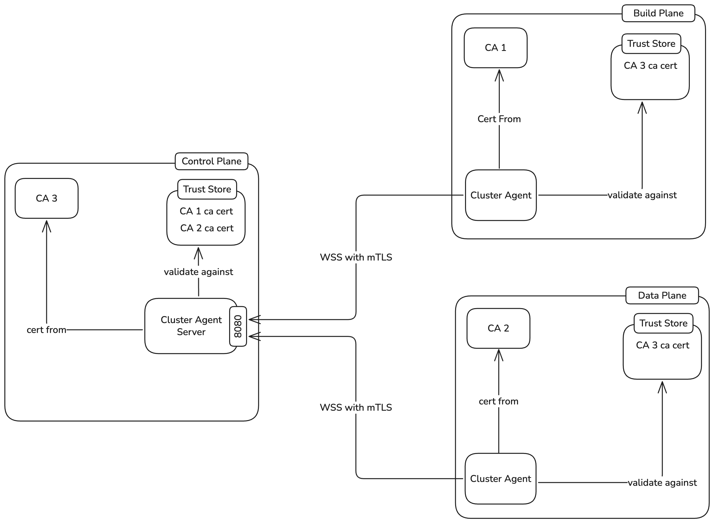
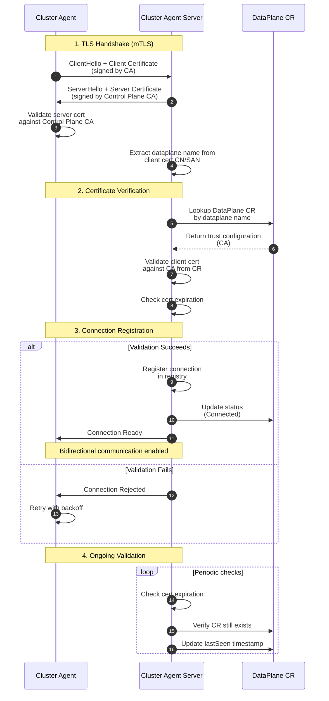

# Introducing Cluster Agent Architecture

**Authors**:
@yashodperera
@VajiraPrabuddhaka

**Reviewers**:
@lakwarus 
@sameerajayasoma
@tishan89 
@manjulaRathnayaka 
@Mirage20 
@binura-g
@mevan-karu 

**Created Date**:
2025-11-12

**Status**:
Submitted

**Related Issues/PRs**:
[Discussion #762](https://github.com/openchoreo/openchoreo/discussions/762)

---

## Summary

The current OpenChoreo architecture requires Data Planes and Build Planes to expose their Kubernetes API servers to the Control Plane, creating security vulnerabilities. Organizations seeking secure connections must implement VPN solutions, adding significant operational complexity and cost.

This proposal introduces a **Cluster Agent** architecture that eliminates the need for exposing Kubernetes APIs or deploying VPNs. The solution implements a bidirectional WebSocket-based communication system where cluster agents establish outbound connections to Control Plane servers using mutual TLS (mTLS) authentication. This reverse connection model ensures:

- No inbound ports exposed on Data/Build Planes
- No VPN infrastructure required
- Automated certificate rotation via cert-manager
- Horizontal autoscaling of agents
- Per-plane agent deployment

---

## Motivation

The current architecture creates a critical security challenge: Data Planes must expose their Kubernetes API servers to enable Control Plane operations. This exposure creates an attack surface that organizations must mitigate through VPN infrastructure, introducing substantial operational burden.

**Core Problems:**

- **Security Risk**: Exposed Kubernetes API servers become targets for unauthorized access attempts
- **VPN Dependency**: Organizations must deploy and maintain VPN infrastructure between Control Planes and all Data/Build Planes
- **Deployment Restrictions**: Environments with strict egress-only policies or corporate firewalls cannot deploy Data Planes
- **Scalability Issues**: Each new plane requires VPN setup and coordinated network configuration changes
- **Compliance Challenges**: Exposing Kubernetes APIs may violate security policies in regulated industries

The proposed Cluster Agent architecture addresses these challenges by implementing a reverse connection model where agents initiate outbound connections to the Control Plane, eliminating inbound port exposure and VPN requirements entirely.

---

## Goals

- **Eliminate port exposure**: Data Planes and Build Planes should not expose any inbound ports for Control Plane communication
- **Remove VPN dependency**: Enable secure Control Plane operations without requiring VPN setup or management
- **Secure authentication**: Implement mutual TLS (mTLS) authentication for all Agent-Server communication
- **Certificate management**: Support automated certificate rotation via cert-manager
- **Horizontal scalability**: Enable horizontal autoscaling of cluster agents
- **Per-plane agents**: Deploy one agent per plane (separate agents for Data Plane and Build Plane)
- **Simple deployment**: Provide straightforward Helm-based installation with minimal configuration
- **Identity validation**: Validate agent identity through certificate verification against DataPlane CR
- **Reliable communication**: Implement request-reply patterns with delivery confirmation and retry support

---

## Non-Goals

- **Replace all Kubernetes API access**: This proposal focuses on Control Plane to Data/Build Plane communication, not internal cluster operations
- **General-purpose service mesh**: The Cluster Agent is specifically designed for Control Plane operations, not application-level service communication
- **Alternative authentication methods**: This proposal uses mTLS exclusively; OAuth2 and other authentication mechanisms are out of scope
- **Identity provider coupling**: The solution must not couple to specific identity providers, as OpenChoreo supports pluggable IdP configurations

---

## Impact

**Control Plane:**
- New Cluster Agent Server component to accept and manage WebSocket connections
- Updated DataPlane and BuildPlane CRDs to include certificate trust configuration
- Controllers updated to communicate through Agent Server instead of direct Kubernetes API
- New certificate validation logic for agent identity verification
- Request-reply correlation and retry logic

**Data Plane / Build Plane:**
- New cluster-agent component deployed via Helm chart
- cert-manager integration for certificate generation and rotation
- One agent per plane
- Agents establish outbound WebSocket connections to Control Plane on startup
- No inbound ports required

**Operational Changes:**
- Reduced attack surface: No exposed Kubernetes API servers
- Certificate lifecycle management via cert-manager
- New monitoring for agent connection status and certificate expiry
- Migration path from direct API access to agent-based communication

**Security:**
- Mutual TLS authentication for all connections
- Certificate-based identity verification
- Support for certificate revocation and rotation
- Cross-validation between agent certificates and DataPlane CR trust configuration

---

## Design

### Architecture Overview

The Cluster Agent architecture consists of three main components:

1. **Cluster Agent Server (Control Plane)**: Accepts WebSocket connections from cluster agents, validates certificates against DataPlane/BuildPlane CRs, maintains connection registry, and routes requests to appropriate agents

2. **Cluster Agent (Data/Build Plane)**: One agent per plane (separate agents for Data Plane and Build Plane), each authenticating via mTLS, executing received requests using in-cluster Kubernetes API access, and returning responses

3. **Certificate Infrastructure**: cert-manager on both Control Plane and Data/Build Planes manages certificate generation, rotation, and lifecycle

### Architecture Diagram



### Registration and Trust Flow

#### Initial Setup

**Step 1: Retrieve Control Plane CA Certificate**

The platform engineer retrieves the CA certificate from the Control Plane:

```bash
choreoctl get ca-cert
```

**Step 2: Install Data/Build Plane with Control Plane CA**

Deploy the Data Plane or Build Plane Helm chart with the Control Plane CA certificate:

```bash
# Install Data Plane with Control Plane CA
helm install openchoreo-dataplane openchoreo/openchoreo-dataplane \
  --namespace openchoreo-system \
  --create-namespace \
  --set-file controlPlane.caCert=cp-ca.crt \
  --set controlPlane.serverURL="wss://agent-server.openchoreo.example.com"
```

This installation:
- Deploys cert-manager (if not already present)
- Creates a namespace-bound CA Issuer and generates a CA certificate
- Creates a Certificate resource for the cluster agent (signed by CA)
- Deploys the cluster agent configured to connect to Control Plane
- Configures the agent to trust the Control Plane CA (for server validation)

**Step 3: Retrieve Data/Build Plane CA Certificate**

After deployment, retrieve the CA certificate:

```bash
# Get the CA certificate (used to sign agent certificates)
kubectl get secret -n <plane-namespace> openchoreo-ca \
  -o jsonpath='{.data.ca\.crt}' | base64 -d > cluster-ca.crt
```

**Step 4: Register DataPlane CR in Control Plane**

Create a DataPlane CR in the Control Plane including the CA certificate:

```diff
apiVersion: openchoreo.dev/v1alpha1
kind: DataPlane
metadata:
  name: production-us-west
  namespace: openchoreo-system
spec:
  kubernetesCluster:
    name: production-cluster
+    trust:
+      rootCAs:
+        - type: InlinePEMBase64
+          value: LS0tLS1CRUdJTi1DQVJUSUZJQ0FURS0tLS0tCg...   
+        - type: SecretRef
+          name: dataplane-rootca
+          key: ca.crt
+          namespace: default
  registry:
    prefix: docker.io/myorg
    secretRef: registry-credentials
  gateway:
    publicVirtualHost: api.example.com
    organizationVirtualHost: internal.example.com
  observer:
    url: https://observer.example.com
    authentication:
      basicAuth:
        username: admin
        password: secretpassword  

status:
  agentConnection:
    - state: Connected  # Connected, Disconnected, Error
      lastSeen: "2025-11-04T10:30:00Z"
      connectedSince: "2025-11-04T08:00:00Z"
      agentVersion: "v1.0.0"
      certificateExpiry: "2026-11-04T08:00:00Z"
      agentId: <agent-name>

  conditions:
    - type: Ready
      status: "True"
      lastTransitionTime: "2025-11-04T08:00:00Z"
      reason: AgentConnected
      message: "Cluster agent successfully connected and authenticated"
    - type: CertificateValid
      status: "True"
      lastTransitionTime: "2025-11-04T08:00:00Z"
      reason: ValidCertificate
      message: "Agent certificate validated successfully"
```

### Certificate-Based Authentication Flow



When a cluster agent connects to the Agent Server:

1. **TLS Handshake**: Agent and Server perform mTLS handshake
   - Agent presents its certificate (signed by CA)
   - Server presents its certificate (signed by Control Plane CA)
   - Agent validates server certificate against Control Plane CA
   - Server validates agent certificate (detailed in next step)

2. **Certificate Verification**: Agent Server validates agent certificate
   - Extracts dataplane name from certificate Common Name (CN) or Subject Alternative Name (SAN)
   - Looks up corresponding DataPlane or BuildPlane CR
   - Validates certificate against CA in CR's `trust.rootCAs`
   - Checks certificate expiration
   - This cross-validation ensures only authorized agents can connect

3. **Connection Registration**: If validation succeeds
   - Server registers connection in connection registry
   - Server updates DataPlane/BuildPlane CR status
   - Connection is ready for bidirectional communication

4. **Ongoing Validation**: Server periodically checks
   - Certificate expiration status
   - CA validity (in case of rotation)
   - DataPlane/BuildPlane CR still exists and is valid

### Agent Deployment Model

**Key Design Decision**: One agent per plane 

If a cluster serves as both Data Plane and Build Plane:
- Two separate cluster agent deployments in the same cluster
- Each agent manages its own connection and lifecycle independently
- Agent 1: Data Plane agent (validated against DataPlane CR)
- Agent 2: Build Plane agent (validated against BuildPlane CR)

Each agent:
- Has its own certificate (different CAs per plane type, CN identifies the plane)
- Is validated against the corresponding DataPlane or BuildPlane CR
- Handles requests specific to that plane type
- Can be scaled horizontally via Deployment replicas

### Certificate Rotation

cert-manager automatically handles certificate rotation:

1. **Before Expiration**: cert-manager renews certificate 30 days before expiry
2. **Secret Update**: New certificate written to the same Secret
3. **Agent Reload**: Cluster agent watches Secret and reloads certificate
4. **Graceful Transition**: Agent reconnects with new certificate
5. **Status Update**: Agent Server updates certificate expiry in DataPlane CR status

For CA rotation scenarios:

1. **Generate New CA**: Create new CA certificate and issuer
2. **Dual Trust Period**: Temporarily add both old and new CAs to trust configuration (future enhancement)
3. **Issue New Certs**: cert-manager issues new certificates from new CA
4. **Agents Reconnect**: Agents reconnect with new certificates
5. **Remove Old CA**: After all agents use new CA, remove old CA from trust config

### Component Details

#### Cluster Agent Server (Control Plane)

**Responsibilities:**
- Accept WebSocket connections with mTLS
- Validate agent certificates against DataPlane/BuildPlane CR trust configuration
- Maintain connection registry mapping dataplane name and plane types to active connections
- Route requests from controllers to appropriate agents
- Implement request-reply correlation with request IDs
- Update DataPlane/BuildPlane CR status based on connection state
- Support controller retries on communication failures

#### Cluster Agent (Data/Build Plane)

**Responsibilities:**
- Establish outbound WebSocket connection to Agent Server
- Perform mTLS handshake with plane-specific certificate
- Maintain persistent connection with automatic reconnection
- Execute requests from Control Plane using in-cluster Kubernetes client
- Send responses back with request ID correlation
- Monitor certificate expiration and reload on rotation
- Support horizontal scaling

### Agent Protocol

**Supported Operations:**
- `apply`: Apply a Kubernetes resource
- `delete`: Delete a Kubernetes resource
- `get`: Get a Kubernetes resource
- `list`: List Kubernetes resources
- `patch`: Patch a Kubernetes resource

**Request-Reply Guarantees:**
- Each request includes a unique `requestID` for correlation
- Responses include the same `requestID` to match request-response pairs
- Timeout-based failure detection enables controller retries
- Error responses indicate if operation is retryable
- Controllers can implement retry logic with exponential backoff

### Security Considerations

**Transport Security:**
- WSS (WebSocket Secure) with TLS 1.3 minimum
- Mutual TLS authentication required
- Certificate validation enforced on both sides
- Support for custom CA certificates

**Authentication:**
- Certificate-based authentication via mTLS
- Cluster identity embedded in certificate CN/SAN
- Plane type embedded in certificate CN
- Certificate validation against DataPlane/BuildPlane CR trust configuration
- Cross-validation ensures only authorized agents can connect

**Authorization:**
- Agent operates with minimal RBAC permissions in its cluster
- Control Plane can only execute operations allowed by agent's service account
- Operations scoped to namespaces and resources defined in RBAC rules
- Different RBAC permissions per plane type (Data vs Build)

**Network Security:**
- Outbound-only connections from Data/Build Planes
- No inbound ports exposed on Data/Build Planes
- Works in egress-only network environments

**Certificate Lifecycle:**
- Automated rotation via cert-manager
- Support for certificate revocation (remove from trust config or delete CR)
- Public keys stored server-side, private keys maintained by agents

---

## Appendix

### Related Discussions

- [Discussion #762 - Cluster Agent for Control Plane Data Plane Communication](https://github.com/openchoreo/openchoreo/discussions/762)
- Key discussion outcomes:
  - **November 7th**: Decided on asymmetric key generation with public keys server-side, private keys agent-side
  - **November 10th**: Adopted mTLS with certificate-based authentication over OAuth2 to avoid identity provider coupling
  - **November 12th**: Finalized one agent per cluster with separate WebSocket connections per plane
  - Agent identity binding via certificates with cross-validation against DataPlane CR
  - Request-reply patterns for delivery confirmation and controller retry support
  - Connection validation against DataPlane CR trust configuration

### References

- [WebSocket Protocol RFC 6455](https://tools.ietf.org/html/rfc6455)
- [TLS 1.3 RFC 8446](https://tools.ietf.org/html/rfc8446)
- [cert-manager Documentation](https://cert-manager.io/docs/)
- [Kubernetes Certificate Management](https://kubernetes.io/docs/tasks/tls/managing-tls-in-a-cluster/)
- [Mutual TLS Authentication](https://en.wikipedia.org/wiki/Mutual_authentication)
