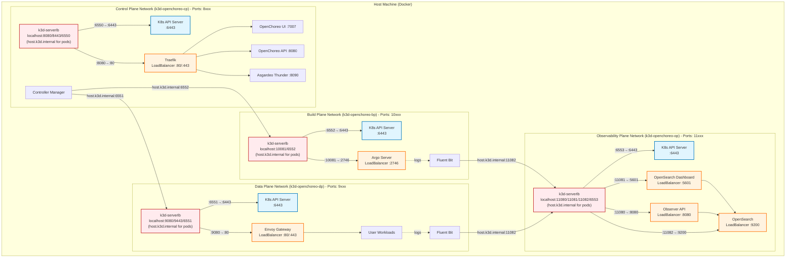

# Multi-Cluster Setup

Production-like setup with each OpenChoreo plane running in its own k3d cluster.

## Overview

This setup creates separate k3d clusters for each plane, providing better isolation and mimicking production
architecture.

## Quick Start

> [!IMPORTANT]
> If you're using Colima, set the `K3D_FIX_DNS=0` environment variable when creating clusters.
> See [k3d-io/k3d#1449](https://github.com/k3d-io/k3d/issues/1449) for more details.
> Example: `K3D_FIX_DNS=0 k3d cluster create --config config-cp.yaml`

### 1. Control Plane

Create cluster and install components:

```bash
# Create Control Plane cluster
k3d cluster create --config install/k3d/multi-cluster/config-cp.yaml

# Install Control Plane Helm chart
helm install openchoreo-control-plane install/helm/openchoreo-control-plane \
  --dependency-update \
  --kube-context k3d-openchoreo-cp \
  --namespace openchoreo-control-plane \
  --create-namespace \
  --values install/k3d/multi-cluster/values-cp.yaml
```

### 2. Data Plane

Create cluster and install components:

```bash
# Create Data Plane cluster
k3d cluster create --config install/k3d/multi-cluster/config-dp.yaml

# Install Data Plane Helm chart
helm install openchoreo-data-plane install/helm/openchoreo-data-plane \
  --dependency-update \
  --kube-context k3d-openchoreo-dp \
  --namespace openchoreo-data-plane \
  --create-namespace \
  --values install/k3d/multi-cluster/values-dp.yaml
```

### 3. Build Plane (Optional)

Create cluster and install components:

```bash
# Create Build Plane cluster
k3d cluster create --config install/k3d/multi-cluster/config-bp.yaml

# Install Build Plane Helm chart
helm install openchoreo-build-plane install/helm/openchoreo-build-plane \
  --dependency-update \
  --kube-context k3d-openchoreo-bp \
  --namespace openchoreo-build-plane \
  --create-namespace \
  --values install/k3d/multi-cluster/values-bp.yaml
```

### 4. Observability Plane (Optional)

Create cluster and install components:

```bash
# Create Observability Plane cluster
k3d cluster create --config install/k3d/multi-cluster/config-op.yaml

# Install Observability Plane Helm chart
helm install openchoreo-observability-plane install/helm/openchoreo-observability-plane \
  --dependency-update \
  --kube-context k3d-openchoreo-op \
  --namespace openchoreo-observability-plane \
  --create-namespace \
  --values install/k3d/multi-cluster/values-op.yaml
```

### 5. Create DataPlane Resource

Create a DataPlane resource to enable workload deployment:

```bash
./install/add-data-plane.sh \
  --control-plane-context k3d-openchoreo-cp \
  --target-context k3d-openchoreo-dp \
  --server https://host.k3d.internal:6551
```

### 6. Create BuildPlane Resource (optional)

Create a BuildPlane resource to enable building from source:

```bash
./install/add-build-plane.sh \
  --control-plane-context k3d-openchoreo-cp \
  --target-context k3d-openchoreo-bp \
  --server https://host.k3d.internal:6552
```

## Port Mappings

| Plane               | Cluster           | Kube API Port | Port Range |
|---------------------|-------------------|---------------|------------|
| Control Plane       | k3d-openchoreo-cp | 6550          | 8xxx       |
| Data Plane          | k3d-openchoreo-dp | 6551          | 9xxx       |
| Build Plane         | k3d-openchoreo-bp | 6552          | 10xxx      |
| Observability Plane | k3d-openchoreo-op | 6553          | 11xxx      |

> [!NOTE]
> Port ranges (e.g., 8xxx) indicate the ports exposed to your host machine for accessing services from that plane. Each
> range uses ports like 8080 (HTTP) and 8443 (HTTPS) on localhost.

## Access Services

### Control Plane

- OpenChoreo UI: http://openchoreo.localhost:8080
- OpenChoreo API: http://api.openchoreo.localhost:8080
- Asgardeo Thunder: http://thunder.openchoreo.localhost:8080

### Data Plane

- User Workloads: http://localhost:9080 (Envoy Gateway)

### Build Plane (if installed)

- Argo Workflows UI: http://localhost:10081

### Observability Plane (if installed)

- Observer API: http://localhost:11080
- OpenSearch Dashboard: http://localhost:11081
- OpenSearch API: http://localhost:11082 (for Fluent Bit and direct API access)

## Verification

Check that all components are running:

```bash
# Control Plane
kubectl --context k3d-openchoreo-cp get pods -n openchoreo-control-plane

# Data Plane
kubectl --context k3d-openchoreo-dp get pods -n openchoreo-data-plane

# Build Plane
kubectl --context k3d-openchoreo-bp get pods -n openchoreo-build-plane

# Observability Plane
kubectl --context k3d-openchoreo-op get pods -n openchoreo-observability-plane

# Verify DataPlane resource in Control Plane
kubectl --context k3d-openchoreo-cp get dataplane -n default

# Verify BuildPlane resource in Control Plane (if created)
kubectl --context k3d-openchoreo-cp get buildplane -n default
```

## Architecture



## Cleanup

Delete all clusters:

```bash
k3d cluster delete openchoreo-cp openchoreo-dp openchoreo-bp openchoreo-op
```

