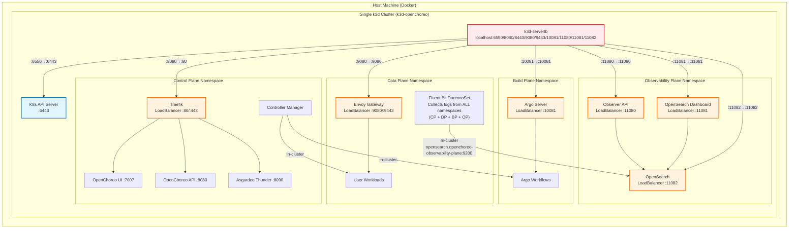

# Single-Cluster Setup

All-in-one OpenChoreo setup with all planes running in a single k3d cluster.

## Overview

This setup creates one k3d cluster that hosts all OpenChoreo planes, providing a simpler development environment with
lower resource requirements.

## Quick Start

> [!IMPORTANT]
> If you're using Colima, set the `K3D_FIX_DNS=0` environment variable when creating clusters.
> See [k3d-io/k3d#1449](https://github.com/k3d-io/k3d/issues/1449) for more details.
> Example: `K3D_FIX_DNS=0 k3d cluster create --config install/k3d/single-cluster/config.yaml`

### 1. Create Cluster

```bash
# Create single OpenChoreo cluster
k3d cluster create --config install/k3d/single-cluster/config.yaml
```

### 2. Install Components

Install all planes in the single cluster:

```bash
# Control Plane
helm install openchoreo-control-plane install/helm/openchoreo-control-plane \
  --dependency-update \
  --kube-context k3d-openchoreo \
  --namespace openchoreo-control-plane \
  --create-namespace \
  --values install/k3d/single-cluster/values-cp.yaml

# Data Plane
helm install openchoreo-data-plane install/helm/openchoreo-data-plane \
  --dependency-update \
  --kube-context k3d-openchoreo \
  --namespace openchoreo-data-plane \
  --create-namespace \
  --values install/k3d/single-cluster/values-dp.yaml

# Build Plane (optional)
helm install openchoreo-build-plane install/helm/openchoreo-build-plane \
  --dependency-update \
  --kube-context k3d-openchoreo \
  --namespace openchoreo-build-plane \
  --create-namespace \
  --values install/k3d/single-cluster/values-bp.yaml

# Observability Plane (optional)
helm install openchoreo-observability-plane install/helm/openchoreo-observability-plane \
  --dependency-update \
  --kube-context k3d-openchoreo \
  --namespace openchoreo-observability-plane \
  --create-namespace \
  --values install/k3d/single-cluster/values-op.yaml
```

### 3. Create DataPlane Resource

Create a DataPlane resource to enable workload deployment:

```bash
./install/add-data-plane.sh --control-plane-context k3d-openchoreo
```

### 4. Create BuildPlane Resource (optional)

Create a BuildPlane resource to enable building from source:

```bash
./install/add-build-plane.sh --control-plane-context k3d-openchoreo
```

## Port Mappings

| Plane               | Namespace                      | Kube API Port | Port Range |
|---------------------|--------------------------------|---------------|------------|
| Control Plane       | openchoreo-control-plane       | 6550          | 8xxx       |
| Data Plane          | openchoreo-data-plane          | -             | 9xxx       |
| Build Plane         | openchoreo-build-plane         | -             | 10xxx      |
| Observability Plane | openchoreo-observability-plane | -             | 11xxx      |

> [!NOTE]
> Port ranges (e.g., 8xxx) indicate the ports exposed to your host machine for accessing services from that plane. Each
> range uses ports like 8080 (HTTP) and 8443 (HTTPS) on localhost. In single-cluster mode, all planes share the same
> Kubernetes API (port 6550).

## Access Services

### Control Plane

- OpenChoreo UI: http://openchoreo.localhost:8080
- OpenChoreo API: http://api.openchoreo.localhost:8080
- Asgardeo Thunder: http://thunder.openchoreo.localhost:8080

### Data Plane

- User Workloads: http://localhost:9080 (Envoy Gateway)

### Build Plane (if installed)

- Argo Workflows UI: http://localhost:10081

### Observability Plane (if installed)

- Observer API: http://localhost:11080
- OpenSearch Dashboard: http://localhost:11081
- OpenSearch API: http://localhost:11082 (for Fluent Bit and direct API access)

## Verification

Check that all components are running:

```bash
# Control Plane
kubectl --context k3d-openchoreo get pods -n openchoreo-control-plane

# Data Plane
kubectl --context k3d-openchoreo get pods -n openchoreo-data-plane

# Build Plane
kubectl --context k3d-openchoreo get pods -n openchoreo-build-plane

# Observability Plane
kubectl --context k3d-openchoreo get pods -n openchoreo-observability-plane

# Verify DataPlane resource
kubectl --context k3d-openchoreo get dataplane -n default

# Verify BuildPlane resource (if created)
kubectl --context k3d-openchoreo get buildplane -n default
```

## Architecture



## Cleanup

Delete the cluster:

```bash
k3d cluster delete openchoreo
```
